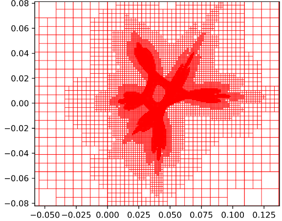

# AdaMGrid
If you use this software, please cite it as: 
@software{Zhang_AdaMGrid_2026,
author = {Zhang, Jiyuan},
month = feb,
title = {{AdaMGrid}},
url = {https://github.com/zhangjiyuan22/AdaMGrid},
year = {2026}
}

<p align="center">
  
  
</p>

### Adaptive magnification-map grid search for binary/triple microlensing on CPU/GPU  
### *(Binary-lens grid search on CPU is released; triple-lens grid search on GPU is in development.)*

Multiple-lens microlensing events (binary and triple lenses) are key probes of cold planets but are difficult to model because their light curves depend on a complex, highly degenerate parameter space. Robust interpretation therefore requires near-full parameter-space searches that are already computationally demanding for binary lenses and, given the larger number of parameters and slower magnification evaluation, not yet feasible for triple lenses. Precomputing reusable magnification maps on a source-plane grid and then evaluating magnifications via interpolation can in principle accelerate searches, but as magnification varies non-uniformly across the source plane, uniform grids are either too coarse near caustics or waste most resolution in smooth regions.

We present **AdaMGrid**, a grid-search framework that evaluates light curves by interpolating on precomputed, adaptively refined magnification maps. Starting from a coarse source-plane grid, AdaMGrid iteratively subdivides only those cells where the discrepancy between interpolated and numerically computed magnifications exceeds a threshold, yielding an adaptive grid that is dense around caustics and sparse in smooth regions. By tying this threshold to a fixed fraction of the expected photometric noise, AdaMGrid keeps interpolation uncertainties well below the photometric uncertainties across the source plane and achieves ≲0.1% relative precision in high-magnification regions, while accelerating magnification evaluation by three orders of magnitude relative to contour integration.

Applied to binary-lens events, AdaMGrid reduces a grid search to ≲30 minutes on a 100–core node using CPU-based interpolation and MCMC, and a forthcoming GPU implementation should reduce this to a few minutes. We further outline a path toward triple-lens parameter space exploration: generating of order 10⁸ reusable triple-lens adaptive magnification maps with VBMicrolensing on a CPU cluster, then exploiting GPU-accelerated interpolation and MCMC to bring triple-lens grid search to timescales of several days per event. These capabilities would enable systematic searches for planets in binary systems in archival data, robust re-analyses of known and candidate triple-lens events, and scalable modeling pipelines for upcoming microlensing surveys with Roman, ET, and other facilities. AdaMGrid is released publicly.

---

## Quick start overview

AdaMGrid has two main steps:

1. **Generate a reusable binary-lens magnification map set** (one-time cost per chosen map grid).
2. **Run a binary-lens grid search for an event** using a pre-generated map set (reusable across events).

---

## Prerequisites

- Python **≥ 3.7**
- Python packages: `numpy`, `scipy`, `matplotlib`, `ctypes`, `emcee`, `PyAstronomy`
- `VBMicrolensing` (installed via pip; see below)

---

## Installation

### 1) Clone the repository
```bash
git clone https://github.com/zhangjiyuan22/AdaMGrid.git
cd AdaMGrid
````

### 2) Install VBMicrolensing

```bash
pip install VBMicrolensing
```

### 3) Compile the C interpolation code

```bash
chmod a+x compile_all
./compile_all
```

---

# Part A — Generate a reusable binary-lens magnification map set (one-time)

### A1) Run the map generator

```bash
python adaptive_map_generator_VBMicrolensingPython_BinaryMag2.py
```

### A2) Default map-set configuration

With the default settings, the script generates a grid of maps over:

* `logs ∈ [-1.5, 1.5]` with `d_logs = 0.05`
* `logq ∈ [-6.0, 4.0]` with `d_logq = 0.1`
* `logrho ∈ [-4.0, -1.6]` with `d_logrho = 0.3`

Each map is:

* a **7 × 7 θE** square,
* centered on the **magnification center**.

For points **outside** the map boundary, the interpolation code falls back to a **single-lens approximation**.

### A3) Resource footprint (default)

* Total map-set size: **~63 GB**
* Typical runtime: **~4 hours on a 96-core node**

**Note (long tail / early stopping):** a small fraction of maps can take much longer than the median. In practice, you can stop early once most maps are produced (e.g., 99.9%) and still proceed with grid searches (missing maps will be skipped).

To monitor progress (default map-set example directory name shown below), count generated `.npz` files:

```bash
ls -l ./map_set_VBMicrolensing5p0Python_logs_minus1p5_to_1p5_dlogs_0p05_logq_minus6_to_4_dlogq_0p1_logrho_minus4p0_to_minus1p6_dlogrho_0p3_layer_16_boxsize_3p5/ \
  | grep "^-" | wc -l
```

For the default map set, the total expected number of maps is **33993**.

### A4) Configuration edits (apply to the map generator)

These edits are in `adaptive_map_generator_VBMicrolensingPython_BinaryMag2.py`.

#### A4.1 Common edits (recommended)

* **Map-set name:** edit **line 14**
* **Parameter ranges / resolutions:** edit **lines 224–231**

  * `logs` range and step
  * `logq` range and step
  * `logrho` range and step
* **Number of CPU cores:** edit **line 301**

#### A4.2 Advanced controls (usually not needed)

* **Map size:** edit **line 12** *(0.5 × map side length in units of θE)*
* **Interpolation accuracy target:** edit **line 104** via `threshold_coefficient`
  * Target condition: `|A_interp - A_VBML| < threshold_coefficient * sqrt(A)`
* **VBMicrolensing numerical settings:** edit **lines 141–143**

  * absolute tolerance
  * relative tolerance
  * limb-darkening coefficient
* **Maximum refinement depth (map layers):** edit **line 173** (`max_layer`)
   * Note: up to **16 layers** (with a 7 × 7 θE map) yields a finest spatial resolution of: `dx ≈ 7 / 2^16 ≈ 1e-4 θE`

---

# Part B — Run a binary-lens grid search for one event (reuses the map set)

### B1) Prepare the light-curve data

1. Create an event directory:

   * `./data/<event_name>/`
2. Put your light curve file(s) in that directory.

**Accepted light-curve formats**

* Columns `[0,1,2]` can be either:

  * `time, mag, mag_err`, or
  * `time, flux, flux_err` (supported by reusing the same file name in both input slots; see script settings below)
* `HJD`, `HJD-2450000`, and `HJD-2400000` are automatically handled; `JD` is allowed by setting a flag (see below).

#### **Tip:** bin non-anomalous regions in advance to speed up the grid search.

### B2) Create an event-specific grid-search script

For each event, copy the template and rename it:

```bash
cp binary_grid_kb240697_fast_struct.py binary_grid_<event_name>_fast_struct.py
```

### B3) Edit the event-specific settings

In `binary_grid_<event_name>_fast_struct.py`:

#### B3.1 Select the map set

* **Map-set name / directory:** edit **line 14**

#### B3.2 Initial guesses and sampling control

* **Alpha initial guesses:** edit **lines 205–206**
  * Default is 16 guesses uniformly spaced in `[0, 2π)`.
* **MCMC settings:** edit **lines 223–224**
  * Default: `nburn_in + nsample = 300 + 500`.

#### B3.3 Event metadata and input files

* **Event name:** edit **line 294**
* **Event RA/Dec (degrees):** edit **lines 295–296**
* **Light-curve file(s):** edit **line 298**

  * Expected columns: `time, mag/flux, err`
* **Flux vs mag handling:** if using flux, repeat the file name at **line 299** 
* **JD vs HJD:** if using JD, set the corresponding switch at **line 304**
* **Error-bar renormalization (Yee et al. 2012):** set `k` and `emin` per dataset at **lines 301–302**

#### B3.4 Single-lens initial guess (recommended)

* **Initial guess of `t0`, `u0`, `tE`:** edit **lines 308–310**
  * Typically obtained from a single-lens fit with the anomaly excluded.

**Note:** for some stellar-binary events, `u0` and `tE` may be poorly constrained by a single-lens fit. In those cases, multiple grid searches with different `u0` initial guesses may be required.

#### B3.5 Time window used in the grid search

* **Time window (HJD-2450000):** edit **lines 314–315**

#### B3.6 Optimizer choice: fmin vs fmin+MCMC

* **Choose `fmin` only vs `fmin + MCMC`:** edit **line 318**

Guidance:

* `fmin` is fastest but can fail catastrophically for poor initial guesses.
* `fmin + MCMC` is slower (dozens of times slower than `fmin` alone) but **strongly recommended** for robustness.
* You can adjust `nburn_in` and `nsample` at **lines 223–224**.

**Hot MCMC (recommended):**

* Set the hot-MCMC factor at **line 321**.
  * Example: `factor = 0.1` means `χ²` is multiplied by `0.1`.

#### B3.7 Grid definition and parallelism

* **logs/logq/logrho grid used in the search:** edit **lines 336–342**
* **Number of CPU cores and output naming:** edit **lines 481 and 488**

### B4) Run the grid search

```bash
python binary_grid_<event_name>_fast_struct.py
```

### B5) Typical performance (reference)

For the test event **kb240697**:

* 1095 data points
* ~33,000 `(logs, logq, logrho)` maps
* 16 alpha initial guesses
* MCMC `300 + 500` steps with 8 walkers per `(logs, logq, logrho, alpha)`

Runtime: **~1 hour on a 96-core node**.

---

## Plot grid-search results

Run:

```bash
python plot_grid_result.py
```

In `plot_grid_result.py`:

* **Event name and result filename:** edit **lines 13 and 15**
* **Max shown Δχ²:** edit **line 17**
* **Hot-MCMC factor:** keep **line 18** consistent with the grid-search setting

Output figure is saved to `./result/`.

To control how many best solutions are printed:

* Edit **line 180** (number of best solutions shown)

Result columns (0–7):

* `chi2, t0, u0, tE, alpha(deg), logs, logq, logrho`


